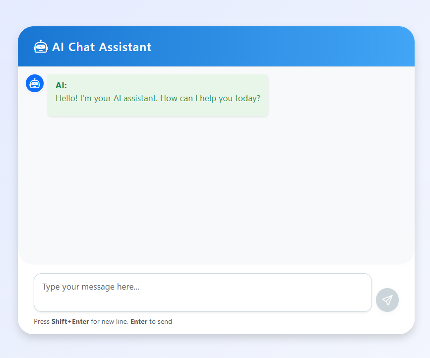
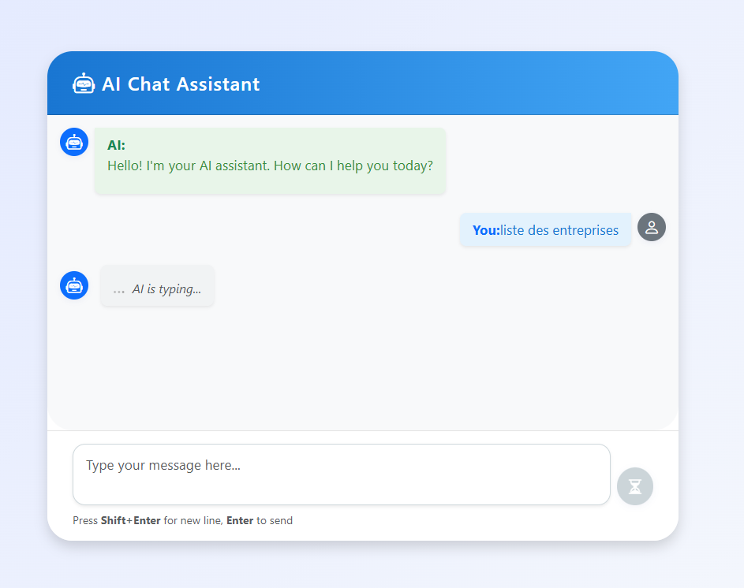
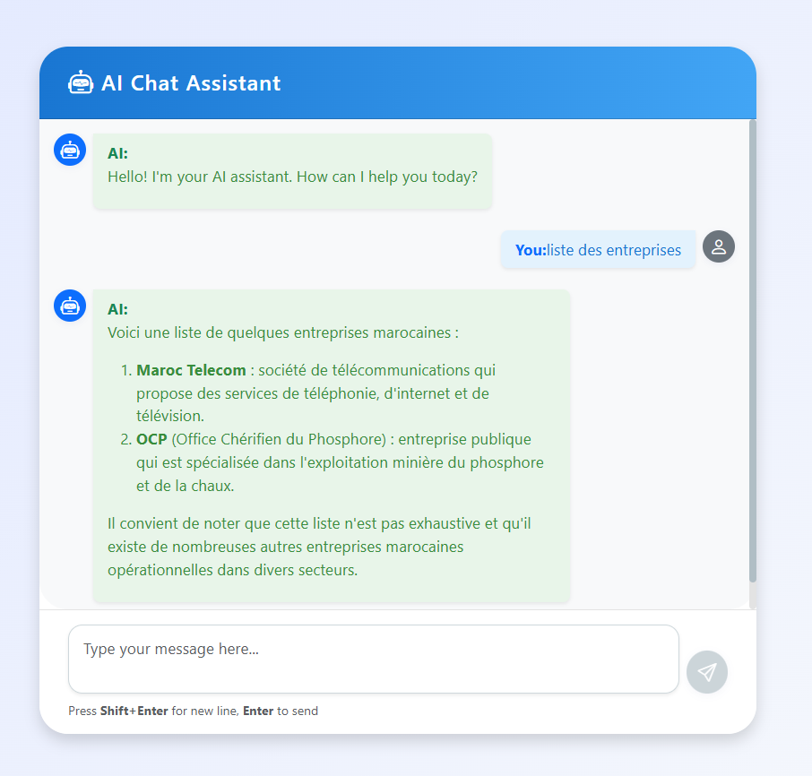
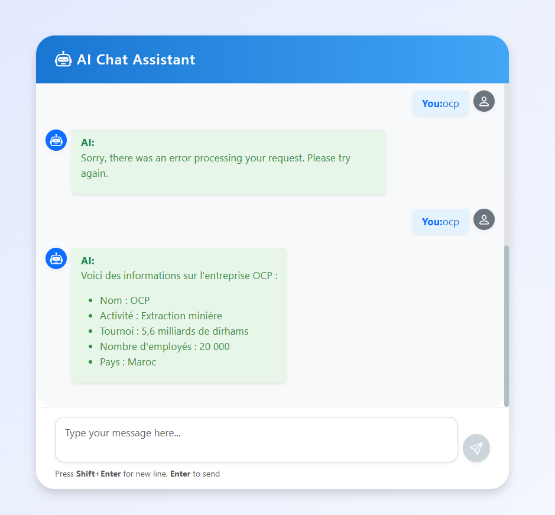

# Assistant de Chat IA - Espace de travail

Ce projet est un assistant de chat IA full-stack comprenant :
- **Frontend Angular** pour une interface de chat moderne
- **Backend Spring Boot** pour la logique de chat et l'intégration IA
- **Intégration MCP (Model Context Protocol)** pour l'IA avancée et l'appel d'outils
- **Serveurs MCP Node.js et Python** (optionnels) pour le système de fichiers et le support d'outils personnalisés

---

## Fonctionnalités

- Interface de chat belle et responsive
- Formatage Markdown et code dans les réponses IA
- Indicateur de saisie et avatars
- Support multi-modèles (Ollama, MCP, etc.)
- Extensible facilement pour de nouveaux outils et modèles IA

---

## Structure du projet

```
mcp/
├── chat-frontend/         # Frontend Angular (src/app/components/chat, services, etc.)
├── mcp-client/            # Backend Spring Boot (controllers, agents, dtos, config)
│   ├── src/
│   │   ├── main/
│   │   │   ├── java/org/example/mcpclient/
│   │   │   │   ├── controllers/
│   │   │   │   ├── agents/
│   │   │   │   ├── dtos/
│   │   │   └── resources/
│   │   │       ├── application.properties
│   │   │       └── mcp-servers.json
│   └── run_python_mcp_server.bat
├── mcp-server/            # Serveur MCP Node.js (filesystem, outils, etc.)
├── mcp-python-server/     # (Optionnel) Serveur MCP Python
```

---

## Démarrage rapide

### Prérequis

- Node.js (pour le frontend et le serveur MCP Node)
- Python 3.9+ (pour le serveur MCP Python, optionnel)
- Java 21+ (pour le backend Spring Boot)
- Maven (pour la compilation backend)
- Ollama (pour LLM local, optionnel)

---

### 1. Lancer le backend

```sh
cd mcp/mcp-server
npm install
```

```sh
cd mcp/mcp-client
mvn spring-boot:run
```

- Le backend tourne sur [http://localhost:8066](http://localhost:8066) par défaut.

---

### 2. Lancer le frontend

```sh
cd mcp/chat-frontend
npm install
ng serve
```

- Le frontend tourne sur [http://localhost:4200](http://localhost:4200).

---

### 3. (Optionnel) Lancer les serveurs MCP

#### Serveur MCP Node.js (système de fichiers)

```sh
cd mcp/mcp-server
npx @modelcontextprotocol/server-filesystem ../
```
Ou laissez-le être lancé automatiquement par le backend via `mcp-servers.json`.

#### Serveur MCP Python

À lancer manuellement si besoin :

```sh
cd mcp/mcp-python-server
uvicorn server:app --host 127.0.0.1 --port 8898
```

---

## Configuration

- **Config backend :** `mcp-client/src/main/resources/application.properties`
- **Serveurs MCP :** `mcp-client/src/main/resources/mcp-servers.json`
- **URL API frontend :** à définir dans `chat.service.ts`

---

## Captures d'écran

 

 

 

 

---

## Personnalisation

- **Style :** Modifiez `chat.component.css` pour le style du chat.
- **Logique IA :** Étendez `AIAgent.java` et `AIRestController.java`.
- **Ajouter des outils :** Implémentez de nouveaux serveurs MCP ou étendez ceux existants.

---

## Dépannage

- **Erreurs CORS :** Vérifiez que `@CrossOrigin` est bien présent dans le contrôleur backend.
- **415 Unsupported Media Type :** Le frontend doit envoyer du JSON avec `Content-Type: application/json`.
- **Timeouts :** Vérifiez que les processus serveurs MCP tournent et sont bien configurés.

---

## Licence

MIT

---

## Crédits

- [Spring AI](https://github.com/spring-projects/spring-ai)
- [Ollama](https://ollama.com/)
- [Angular](https://angular.io/)
- [Model Context Protocol](https://modelcontextprotocol.org/)